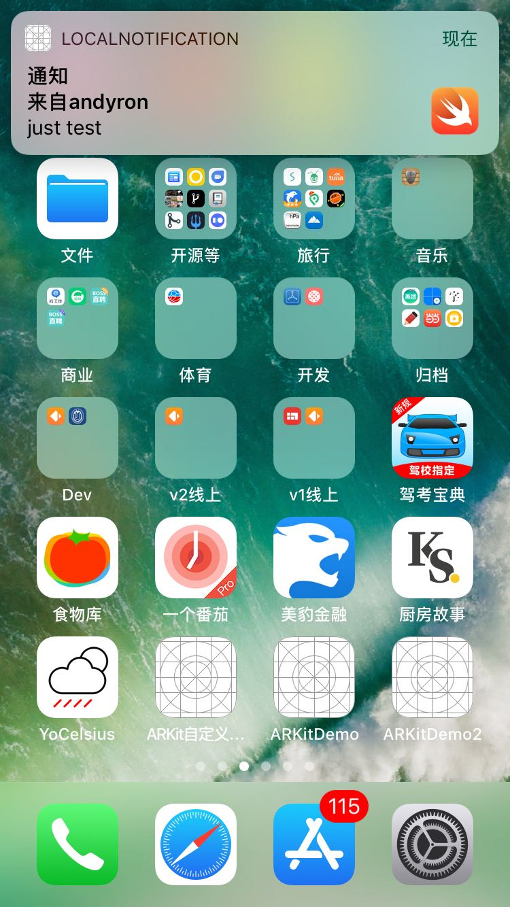

LocalNotification
----------

本地通知

知识点：`UserNotifications`, `UNTimeIntervalNotificationTrigger`

点击发送本地通知按钮后要进入主屏，因为在应用内不能接受本地通知。

参考：[Local Notification Tutorial](https://www.ioscreator.com/tutorials/local-notification-tutorial-ios10)

### 预览图

