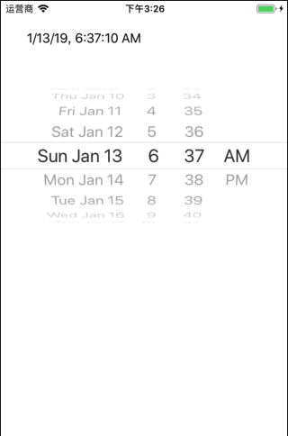

DatePickerTutorial 
----------------
日期选择器使用

知识点：`UIDatePicker` `DateFormatter`

参考：[Displaying Date with Date Picker in iOS8 with Swift](https://www.ioscreator.com/tutorials/display-date-date-picker-ios8-swift)

知识点: `UIDatePicker`, `DateFormatter`

