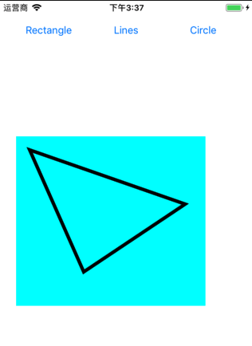

DrawShapesTutorial 
----------------- 

UIGraphics 基本使用

> 参考：[Drawing Shapes with Core Graphics Tutorial](https://www.ioscreator.com/tutorials/drawing-shapes-core-graphics-tutorial-ios10)

知识点： `CGContext`   `UIGraphicsGetCurrentContext()`