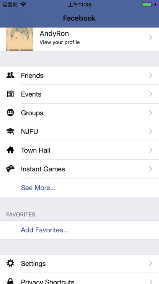

LearniOSByProject
-------

## 介绍

[LearniOSByProject](https://github.com/andyRon/LearniOSByProject)本来是自己学习iOS时的一些非常简单小例子，小项目，或者我个人博客[AndyRon's Blog](http://andyron.com)文章的代码集合。没有按照什么路线学习，就是学到什么就是什么了，看上去特别乱，我自己有时候也非常懵逼，然后看到道长前辈的项目[Swift-30-Projects](https://github.com/soapyigu/Swift-30-Projects)，就整理、筛选一下，这样看着清晰一点，找起来也方便。  

- 语言方面大部分是Swift，个别项目是OC。
- 以数字为目录只是为了记录项目数和排序，没有特殊意义。
- 下载单个项目可以参考 [DownGit：怎么下载github中某个文件夹？](http://andyron.com/2017/downgit)

## 总览图

## 一些项目的预览图

|  项目名      |  [QRCodeReader](./P003-QRCodeReader/)    |  [CoreSpotlightTutorial](./P030-CoreSpotlightTutorial/)    |  [SnapBehaviourTutorial](./P056-SnapBehaviourTutorial/) |
| ---- 		| :----: | :----: | :--------------------------------------------: |
| 预览图     |    |   |    |

|  项目名      | [ScrollViewPagingTutorial](./P060-ScrollViewPagingTutorial/)  |  [TableCellAnimation](./65/)   |  [Label](./P066-Label/) |
| ---- 		| :----: | :----: | :--------------------------------------------: |
| 预览图     |    |   |     |

|  项目名      | [FancyButton](./P077-FancyButton/)  | [AnimatedSplash](./P082-AnimatedSplash/)   | [slideOutMenu](./P097-slideOutMenu/)  |
| ---- 		| :----: | :----: | :--------------------------------------------: |
| 预览图     |    |    |   |

|  项目名      |  [dropDownMenu](./P100-dropDownMenu/) |  [MasonryDemo](./P101-MasonryDemo/)  |  [SnapchatMenu](./P102-SnapchatMenu/) |
| ---- 		| :----: | :----: | :--------------------------------------------: |
| 预览图     |    |    |   |

|  项目名      | [QuoraDots](./P103-ARQuoraDots/)  |  [GoodAsOldPhones](./P105-GoodAsOldPhones/)  | [CandySearch](./P109-CandySearch/)  |
| ---- 		| :----: | :----: | :--------------------------------------------: |
| 预览图     |    |    |   |

|  项目名      | [Carousel Effect](./P079-CarouselEffect/)  | [FacebookMe](P110-FacebookMe/)   |  [CoreSpotlightTutorial](P030-CoreSpotlightTutorial/) |
| ---- 		| :----: | :----: | :--------------------------------------------: |
| 预览图     |    |    |   |

## 详细列表

| 编号  | 项目名称 | 分类     | 介绍 		  | 备注 |
| ---- | :----: | :-----: | :-----------: | :----: |
| P001  | [StopWatch](P001-StopWatch/) | UIKit&Foundation | `Timer`简单使用 |        | 
| P002 | [CunstomFont](P002-CunstomFont/) | UIKit&Foundation | 加载字体文件修改字体 |  |
| P003 | [QRCodeReader](P003-QRCodeReader/) | AVFoundation | 用`AVFoundation`来识别二维码or条形码 | |
| P004 | [Detector](P004-Detector/) | CoreImage | 用**CoreImage**进行面部识别 | |
| P005 | [SpeechToTextDemo](P005-SpeechToTextDemo/) | Speech | 语音转换为文字 | |
| P007 | [LocalNotification](P007-LocalNotification/) | UserNotifications | 本地通知 | |
| P008 | [CAGradientLayer](P008-CAGradientLayer/) | QuartzCore | 颜色渐变 | |
| P010 | [TwitterTutorial](P010-TwitterTutorial/) | Social | 分享 | |
| P011 | [CustomizeNavBarTutorial](P011-CustomizeNavBarTutorial/) | UIKit&Foundation | 定制导航栏 | |
| P012 | [ShadowButtonTutorial](P012-ShadowButtonTutorial/) | QuartzCore | button的阴影 | |
| P014 | [DatePickerTutorial](P014-DatePickerTutorial/) | UIKit&Foundation | 日期选择器使用 | |
| P015 | [UIStepperTutorial](P015-UIStepperTutorial/) | UIKit&Foundation | `UIStepper`的使用 | |
| P016 | [SpriteKitBackgroundTutorial](P016-SpriteKitBackgroundTutorial/) | SpriteKit | `SpriteKit`背景设置 | |
| P017 | [DrawShapesTutorial](P017-DrawShapesTutorial/) | UIGraphics | UIGraphics 基本使用 | |
| P018 | [DrawGradientsTutorial](P018-DrawGradientsTutorial/) | CoreGraphics | `CGGradient`制作渐变色 | |
| P019 | [TabBarCustomizationTutorial](P019-TabBarCustomizationTutorial/) | UIKit&Foundation/UITabBarController | 定制TabBar | |
| P022 | [SpellingCheckerTutorial](P022-SpellingCheckerTutorial/) | UIKit&Foundation | 通过`UITextChecker`检查英语单词拼写是否正确 | |
| P023 | [DraggingViewsTutorial](P023-DraggingViewsTutorial/) | UIKit&Foundation | 视图拖动 | |
| P024 | [VibrationTutorial](P024-VibrationTutorial/) | AudioToolbox | 震动 | |
| P025 | [XMLParserTutorial](P025-XMLParserTutorial/) | UIKit&Foundation | XML文件解析 | |
| P027 | [MultipleOutletsTutorial](P027-MultipleOutletsTutorial/) | UIKit&Foundation | `UIView`的`tag`使用和事件添加 | |
| P029 | [PlayMusicAVAudioPlayerTutorial](P029-PlayMusicAVAudioPlayerTutorial/) | AVFoundation | 音频的播放、暂停和停止。 | |
| P030 | [CoreSpotlightTutorial](P030-CoreSpotlightTutorial/) | CoreSpotlight | CoreSpotlight的使用 | |
| P032 | [SwiftCoreImageTutorial](P032-SwiftCoreImageTutorial/) | CoreImage | `CoreImage`的图片滤镜功能 | |
| P033 | [ContextMenuTableViewTutorial](P033-ContextMenuTableViewTutorial/) | UIKit&Foundation | TableView的的cut/copy/paste操作 | |
| P034 | [TextFieldAlertControllerTutorial](P034-TextFieldAlertControllerTutorial/) | UIKit&Foundation | UIAlertController的简单使用 | |
| P035 | [TakeVideoPlayerTutorial](P035-TakeVideoPlayerTutorial/) | Photos | 拍摄视频和查看图库 | |
| P036 | [SearchMapTutorial](P036-SearchMapTutorial/) | MapKit | 地图搜索 | |
| P037 | [AirdropTutorial](P037-AirdropTutorial/) | UIKit&Foundation | UIActivityViewController 分享| |
| P038 | [ReorderingCollectionViewTutorial](P038-ReorderingCollectionViewTutorial/) | UIKit&Foundation | `UICollectionViewController`的基本使用 | |
| P042 | [AddEventTutorial](P042-AddEventTutorial/) | EventKit | 向日历中添加提醒 | |
| P046 | [ScrollViewTutorial](P046-ScrollViewTutorial/) | | `UIScrollView`的简单使用 | |
| P049 | [TouchIDTutorial](P049-TouchIDTutorial/) | LocalAuthentication | TouchID的简单使用 | |
| P052 | [CustomCollectionViewCellsTutorial](P052-CustomCollectionViewCellsTutorial/) | UIKit&Foundation | UICollectionViewController的简单使用 | |
| P053 | [SendSMSTutorial](P053-SendSMSTutorial/) | MessageUI | 调用**信息**APP发送短信 | |
| P056 | [SnapBehaviourTutorial](P056-SnapBehaviourTutorial/) | UISnapBehavior | | |
| P060 | [ScrollViewPagingTutorial](P060-ScrollViewPagingTutorial/) | UIKit&Foundation | 用`UIScrollView`做左右翻页效果 | |
| P066 | [Label](P066-Label/) | SpriteKit | SpriteKit学习 | |
| P073 | [CALayerDemo](P073-CALayerDemo/) | QuartzCore | CALayer基础 | |
| P074 | [GeoTargeting](P074-GeoTargeting/) | | | |
| P075 | [QuickLookDemo](P075-QuickLookDemo/) | QuickLook | `QuickLook`的使用 | |
| P077 | [FancyButton](P077-FancyButton/) | UIKit&Foundation | IBDesignable和IBInspectable的使用 | |
| P078 | [PlayLocalVideo](P078-PlayLocalVideo/) | AVFoundation | 本地视频播放 | |
| P079 | [CarouselEffect](P079-CarouselEffect/) | UIKit&Foundation | 用`UICollectionView`实现照片横屏滑动 | |
| P080 | [BackgroundVideoDemo](P080-BackgroundVideoDemo/) | AVFoundation | 视频背景 | |
| P083 | [GestureDemo](P083-GestureDemo/) | UIKit&Foundation | 手势处理示例集合 | |
| P091 | [network](P091-network/) | UIKit&Foundation | 网络基础例子 | OC|
| P100 | [dropDownMenu](P100-dropDownMenu/) | Animations | 简单的下拉菜单 | |
| P101 | [MasonryDemo](P101-MasonryDemo/) | Open Source | Masonry实现一个计算器界面 | |
| P105 | [GoodAsOldPhones](P105-GoodAsOldPhones/) | UIKit&Foundation | | |
| P106 | [LoveTweet](P106-LoveTweet/) | UIKit&Foundation | | |
| P107 | [Todo](P107-Todo/) | UIKit&Foundation | | |
| P109 | [CandySearch](P109-CandySearch/) | UIKit&Foundation | UISearchController和UISplitViewController的使用 | |
| P110 | [FacebookMe](P110-FacebookMe/) | UIKit&Foundation/UITableView | 模仿Facebook个人页面 |  |
| P114 | [SnapKitDemo](P114-SnapKitDemo/) | Open Source | SnapKit实现一个计算器界面 | |
| P115 | [PersistData](P115-PersistData) | | 数据持久化的几个例子| |
| P118 | [TravelVlogs](P115-TravelVlogs) | AVKit&AVFoundation | 使用AVKit和AVFoundation框架构建简单的视频流 | |
| P119 | [DrawPad](P115-DrawPad) | UIGraphics | 简单的绘图应用 | |
| P123 | [RWConnect](P123-RWConnect) | Contacts | 通讯录简单使用 | |

## 学习一些来源

- http://www.appcoda.com/
- https://www.ioscreator.com/
- https://www.raywenderlich.com/
- **[30DaysofSwift](https://github.com/allenwong/30DaysofSwift)**
- **[Swift-30-Projects](https://github.com/soapyigu/Swift-30-Projects)**

