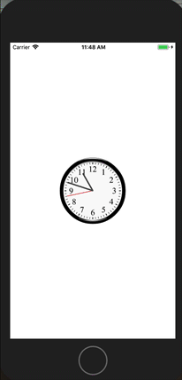
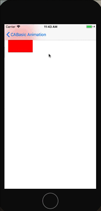
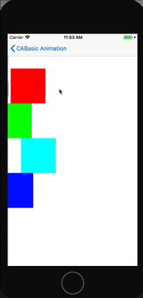

# LearniOSByProject
-------

> - 学习iOS的一些小项目，主要是Swift3，Swift4，少部分OC。  
> - 以数字为目录只是为了记录项目数和排序，没有特殊意义。
> - 下载单个项目可以参考 [DownGit：怎么下载github中某个文件夹？](http://www.jianshu.com/p/ca46d0fa69ef)


## 学习一些来源
- http://www.appcoda.com/
- https://www.ioscreator.com/
- https://www.raywenderlich.com/
- **[30DaysofSwift](https://github.com/allenwong/30DaysofSwift)**


## 1 StopWatch
> **[30DaysofSwift](https://github.com/allenwong/30DaysofSwift)**

## 2 project-2-CunstomFont
- 点击按钮然后改变字体

## 3 QRCodeReader 扫描二维码or条形码
> 参考：[Building a Barcode and QR Code Reader in Swift 3 and Xcode 8](http://www.appcoda.com/barcode-reader-swift/)

- **AVFoundation framework**

## 4 Detector 用Core Image进行面部识别
> [Face Detection in iOS Using Core Image](http://www.appcoda.com/face-detection-core-image/)

-  Core Image and UIView (or UIKit) use two different coordinate systems

## 5 SpeechToTextDemo 语音识别
> 参考： [Building a Speech-to-Text App Using Speech Framework in iOS 10](http://www.appcoda.com/siri-speech-framework/)

- **Speech framework**
- `Locale`的 identifier可参考 https://gist.github.com/jacobbubu/1836273
- https://developer.apple.com/videos/play/wwdc2016/509/

## 6 RequestingPermission 用户当前位置
> 参考：[Requesting Permission in Core Location Tutorial](https://www.ioscreator.com/tutorials/requesting-permissions-core-location-tutorial)
> 知识点：`CoreLocation` `CLLocationManager` `CLLocationManagerDelegate` `CLLocation`


## 7 LocalNotification 本地通知
> 参考：[Local Notification Tutorial](https://www.ioscreator.com/tutorials/local-notification-tutorial-ios10)
> 知识点：`UNMutableNotificationContent`, `UNNotificationAttachment`, `UNNotificationRequest`, `UNUserNotificationCenter`, `UNTimeIntervalNotificationTrigger`


- 新建项目
- 添加按钮
- 请求用户通知允许
```
    override func viewDidLoad() {
        super.viewDidLoad()
        UNUserNotificationCenter.current().requestAuthorization(options: [.alert], completionHandler: {
        (success, error) in
            if success {
                print("success")
            } else {
                print("error")
            }
        })
    }
```

- 添加按钮点击Action，发送本地通知，主要发送通知后要进入主屏（在应用内，不能接受本地通知）：
```
    @IBAction func sendLocalNotification(_ sender: UIButton) {
        // UNMutableNotificationContent 对象包含有通知当中的数据。
        let content = UNMutableNotificationContent()
        content.title = "通知"
        content.subtitle = "来自andyron"
        content.body = "just test"
        
        // UNNotificationAttachment 对象包含有通知当中的媒体内容。
        let imageName = "Swift_Logo"
        guard let imageUrl = Bundle.main.url(forResource: imageName, withExtension: "png")  else { return }
        
        let attachment = try! UNNotificationAttachment(identifier: imageName, url: imageUrl, options: .none)
        
        content.attachments = [attachment]
        
        let trigger = UNTimeIntervalNotificationTrigger(timeInterval: 5, repeats: false)
        let request = UNNotificationRequest(identifier: "notification.id.01", content: content, trigger: trigger)
        
        UNUserNotificationCenter.current().add(request, withCompletionHandler: nil)
        
        print("已发送")
    }
```

### 代码
[ScrollViewTutorial](https://github.com/andyRon/LearniOSByProject/tree/master/7)

## 8 CAGradientLayer 颜色渐变
> 参考： [Creating Gradient Colors Using CAGradientLayer](http://www.appcoda.com/cagradientlayer/)

- Core Graphics 功能复杂一点
- CAGradientLayer 简单适合新手， radial gradient is not supported
- Gradient Direction
    + 这边的坐标系比较特殊： 左上角点是(0.0, 0.0)，右下角是(1.0, 1.0).
    + Mac系统的是: 左下角点是(0.0, 0.0)，右上角是(1.0, 1.0)

## 9 OneHourWalker ??
 http://www.appcoda.com/healthkit-introduction/


## 10 TwitterTutorial 分享到推特
> 参考： [Twitter iOS Tutorial](https://www.ioscreator.com/tutorials/twitter-ios-tutorial-ios10)

- 知识点
    + `Social`
    + `UIImagePickerController`, `UIImagePickerControllerSourceType`, `SLComposeViewController`
- 步骤
    1. 建立类型为**Single View Application**， product name为****
    2. 添加一个 **Image View**，属性**Content Mode**设置为*Aspect Fit*
    3. 添加两个按钮，*title*分别为"Choose Image" and "Tweet"
    4. 给**Image View**添加限制
    5. 给两个按钮添加一定限制
    6. 在**ViewController.swift**中，为**Image View**添加outlet，为两个按钮添加Action
    7. 使用**Social framework** : `import Social`
    8. `ViewController`  实现 `UINavigtionControllerDelegate` , `UiImagePickerControllerDelegate`
    9. 定义 `var pickerController: UIImagePickerController = UIImagePickerController()`，用于获取图片
    10. 实现方法`chooseImagePressed`
    ```
    @IBAction func chooseImagePressed(_ sender: UIButton) {
        
        pickerController.delegate = self
        pickerController.sourceType = UIImagePickerControllerSourceType.photoLibrary
        
        present(pickerController, animated: true, completion: nil)
    }
    ```
    11. 实现方法`tweetButtonPressed`
    ```
    @IBAction func tweetButtonPressed(_ sender: UIButton) {
        
        if SLComposeViewController.isAvailable(forServiceType: SLServiceTypeTwitter) {
            
            if let tweetSheet = SLComposeViewController(forServiceType: SLServiceTypeTwitter) {
                
                tweetSheet.setInitialText("看着漂亮的图片了")
                tweetSheet.add(imageView.image)
                
                present(tweetSheet, animated: true, completion: nil)
            }
        } else {
            print("error")
        }
    }
    ```
    12. 实现代理方法`imagePickerController:didFinishPickingMediaWithInfo`
    13. 在**Inof.plist**中添加图库或相机使用key

## 11 CustomizeNavBarTutorial 定制化Nav Bar
> 参考：[Customizing Navigation Bar iOS Tutorial](https://www.ioscreator.com/tutorials/customizing-navigation-bar-ios-tutorial-ios10)

- 知识点
    + `UINavigationBar` 

## 12 ShadowButtonTutorial button的阴影
> 参考：[Add Shadow to a Button iOS Tutorial](https://www.ioscreator.com/tutorials/add-shadow-to-a-button-ios-tutorial-ios10)

## 13 FadeMusicTutorial  音乐的声音的渐变
- 知识点
    + `AVFoundation` `AVAudioPlayer`

## 14 DatePickerTutorial 日期选择器使用

> 参考：[Displaying Date with Date Picker in iOS8 with Swift](https://www.ioscreator.com/tutorials/display-date-date-picker-ios8-swift)

- 知识点
    + `UIDatePicker`
    + `DateFormatter`

## 15 UIStepperTutorial `UIStepper`的使用
> 参考：[UIStepper Tutorial in iOS8 with Swift](https://www.ioscreator.com/tutorials/uistepper-tutorial-ios8-swift)

- 知识点
    + `UIStepper`

## 16 SpriteKitBackgroundTutorial `SpriteKit`背景设置
> 参考：[Display Background with SpriteKit iOS Tutorial](https://www.ioscreator.com/tutorials/display-background-with-spritekit-ios-tutorial-ios10)

## 17 DrawShapesTutorial
> 参考：[Drawing Shapes with Core Graphics Tutorial](https://www.ioscreator.com/tutorials/drawing-shapes-core-graphics-tutorial-ios10)

- 知识点
    + `CGContext`   `UIGraphicsGetCurrentContext()`

## 18 DrawGradientsTutorial
> 参考：

- 知识点
    + `CGGradient`

## 19 TabBarCustomizationTutorial
> 参考：[Tab Bar Customisation Tutorial](https://www.ioscreator.com/tutorials/tab-bar-customisation-tutorial-ios10)

- 知识点
    + `UITabBarController`

## 20 ChangeDisplayNameTutorial  改变app在Home screen时的显示名
> 参考：

- 知识点
    +  **info.plist**中 **Bundle display name**,

## 21 OpenPDFTutorial
> 参考：

## 22 SpellingCheckerTutorial
> 参考：

- 知识点
    + Double-click on the Navigation Bar in The Table View Controller and set the title to "Choose the right spelling". 
    + `UITextChecker`  `rangeOfMisspelledWord()`

## 23 DraggingViewsTutorial
> 参考：

- 知识点
    + `UIPanGestureRecognizer`
    + `insetBy()`

## 24 VibrationTutorial   震动 
> 参考：

## 25 XMLParserTutorial
> 参考：

- 知识点
    + `XMLParser`

## 26 DrawRouteMapKitTutorial ??
> 参考：
> 
- 知识点
    + `` 
- [参考](https://www.ioscreator.com/tutorials/draw-route-mapkit-tutorial)

## 27 MultipleOutletsTutorial
> 参考：

- 知识点
    + `UIView.subviews`
    + `UIControl.addTarget()`

## 28 SpriteKitPhysicsTutorial  ??
> 参考：

- [参考](https://www.ioscreator.com/tutorials/sprite-kit-physics-tutorial)

## 29 PlayMusicAVAudioPlayerTutorial
> 参考：

## 30 CoreSpotlightTutorial 
> 参考：

## 31 SwiftFileManagementTutorial  ?? 
> 参考：

try? ?
- [参考](https://www.ioscreator.com/tutorials/file-management-tutorial-ios8-swift)


## 32 SwiftCoreImageTutorial  图片滤镜
> 参考：

- 知识点
    + `CIImage`   保存图像数据的类
    + `CIFilter`   滤镜类 图片属性进行细节处理的类 它对所有的像素进行操作 用键-值 （KVC）来设置

## 33 ContextMenuTableViewTutorial   table的 cut/copy/paste操作
> 参考：

- 知识点
    + `UIResponderStandardEditActions`
    +  `tableView:shouldShowMenuForRowAtIndexPath`    `tableView:canPerformAction:forRowAtIndexPath`   `tableView:performAction:forRowAtIndexPath:withSender` 
    + `textFieldShouldReturn`

## 34 TextFieldAlertControllerTutorial
> 参考：

## 35 TakeVideoPlayerTutorial
> 参考：

- 知识点
    + `UIImagePickerControllerMediaType`
    + `Photos`框架 ??

## 36 SearchMapTutorial
> 参考：

- 知识点
    + `MKLocalSearchRequest`  `MKCoordinateSpan` `MKLocalSearch`

## 37 AirdropTutorial
> 参考：

- 知识点
    + `UIActivityViewController`
 
## 38 ReorderingCollectionViewTutorial
> 参考：

## 39 ScaleImagesTutorial
> 参考：

- 知识点
    + `UIPinchGestureRecognizer`  `CGAffineTransform`

## 40 UserDefaultsTutorial  程序被杀掉后数据还能保存
- 知识点
    + `UserDefaults`

## 41 ScreenEdgePanGesturesTutorial 屏幕边缘手势
- 知识点
    + `UIScreenEdgePanGestureRecognizer`

## 42 AddEventTutorial
- 知识点
    + `EventKit`  `EKEventStore`
    + 向日历中添加事件

## 43 ToadyExtension
- 知识点
    + `ProcessInfo().operatingSystemVersion`
    + **Application Extension**

## 44 AddSearchTableViewTutorial
- 知识点
    + `NSPredicate`
    + `UISearchResultsUpdating`
    + `UISearchController`
    + 闭包的一种写法

## 45 MoveViewKeyboardTutorial  ??
(https://www.ioscreator.com/tutorials/move-view-behind-keyboard-ios8-swift)


## 46 ScrollViewTutorial 滚动视图
> 参考：[Scroll View Tutorial in iOS8 with Swift](https://www.ioscreator.com/tutorials/scroll-view-tutorial-ios8-swift)
> 知识点: `UIScrollView`

  

当视图超过屏幕大小时，可通过把视图放在`UIScrollView`中让视图可以上下滚动的功能。以一张大图片为例。

- 新建项目 **ScrollViewTutorial**
- 代码：
```
class ViewController: UIViewController {
    
    var imageView: UIImageView!
    var scrollView: UIScrollView!
    
    override func viewDidLoad() {
        super.viewDidLoad()

        imageView = UIImageView(image: UIImage(named: "strandvagen.jpg"))
        
        scrollView = UIScrollView(frame: view.bounds)
        scrollView.backgroundColor = UIColor.black
        
        scrollView.contentSize = imageView.bounds.size
        
        scrollView.addSubview(imageView)
        
        view.addSubview(scrollView)
    }

    
}
```

### 代码
[ScrollViewTutorial](https://github.com/andyRon/LearniOSByProject/tree/master/46)

## 47 EmailTutorial
> 参考：

## 48 ActivityIndicatorStatusBarTutorial  状态栏中的菊花转
> 参考：

## 49 TouchIDTutorial
> 参考：

## 50 CustomFontTutorial
https://www.ioscreator.com/tutorials/custom-fonts-interface-builder-tutorial-ios8-swift

## 51 LongPressGesturesTutorial
> 参考：

- 步骤
    + 按钮
    + Drag a Long Press Gesture Recognizer from the Object Library on top of the Button
    + 把按钮的**gestureRecognizers**的outlet关联到**Long Press Gesture Recognizer**
    
## 52 CustomCollectionViewCellsTutorial
> 参考：

## 53 SendSMSTutorial
> 参考：

- 知识点
    + `MessageUI` `MFMessageComposeViewControllerDelegate` `MFMessageComposeViewController`

## 54 SwipeGestureTutorial
> 参考：

## 55 BlurEffectTutorial
> 参考：

## 56 SnapBehaviourTutorial
> 参考：

## 57 DrawingCirclesTutorial
> 参考：

## 58 ShakeGestureTutorial  震动
> 参考：

## 59 VolumeTutorial  
> 参考：

## 60 ScrollViewPagingTutorial

## 61 AddRowsTableViewTutorial 
https://www.ioscreator.com/tutorials/add-rows-table-view-tutorial-ios8-swift

## 62 PathsNLayers
- [参考](http://www.appcoda.com/bezier-paths-introduction/)
- https://developer.apple.com/library/content/documentation/2DDrawing/Conceptual/DrawingPrintingiOS/BezierPaths/BezierPaths.html
- 知识点
    + `UIBezierPath`  create vector-based paths
    + `CGContext`   `CAShapeLayer`
- goal in this tutorial is to give you practical guidelines on how to create bezier paths and how to use shape layer objects along with them

## 63 Building a Custom Content View with UITableView and MapKit
- https://www.appcoda.com/custom-content-view/
- 以 Cureo(http://curetoapp.com/) 应用的为例来展示
?? 

## 64 Firebase
1. FirebaseTutorial
    - [Introducing Firebase with Swift 3: Login and Sign Up](http://www.appcoda.com/firebase-login-signup/)
    - AdMob notifications  cloud messaging and storage
    - 步骤
        + 设计UI
        + 在Firebase中创建项目
            * 在iOS项目中添加 `GoogleService-Info.plist` 文件
            * install pod
            

## 65 Intermediate iOS 10 Programming with Swift
- appcoda 网站书籍[Intermediate iOS 10 Programming with Swift](https://www.appcoda.com/intermediate-swift-programming-book/)的学习笔记。**Intermediate**每一节是一个项目


## 66 SpriteKit Introduction
- http://www.appcoda.com/spritekit-introduction/
- SpriteKit
Scenes
Nodes
Labels
Points
Gesture recognisers
Actions
- *Game Technology*  **SpriteKit** **SceneKit** **OpenGL ES** **Metal**
- 删除 GameScene.sks and Actions.sks；清空 GameViewController.swift GameScene.swift
- Creating the View Controller
- Creating a Scene
- Adding a Node to the Scene
- Centering the Label
- Adding a Gesture Recogniser to the Scene
- Creating an SKAction
- Working with Sequence
- ?? 3

## 67 UILabelDemo
- `UILabel` API 使用
- 常用
    1. `text` 显示文本内容 
    2. `textColor` 文字颜色 
    3. `font` 字体 
    4. `shadowColor` 文字的阴影颜色 
    5. `shadowOffset` 阴影的偏差距离（width水平方向的偏差距离，整数右边；height垂直方向上的偏差距离，正数下边） 
    6. `textAlignment` 设置文字的排列方式（偏左、偏右、居中） 
    7. `numberOfLines` 允许文字最多几行（默认1，如果是0，自动换行） 
    8. `sizeToFit()` UILabel的高度自适应文本
    9. `attributedText` 富文本

## 68 Exif
- 可交换图像文件格式常被简称为Exif（Exchangeable image file format），是专门为数码相机的照片设定的，可以记录数码照片的属性信息和拍摄数据。 

## 69 UIButtonDemo
- button类型
- 
```
 UIButtonTypeCustom = 0,    
 UIButtonTypeRoundedRect,    四个角是圆弧   型的 
 UIButtonTypeDetailDisclosure, 
 UIButtonTypeInfoLight, 
 UIButtonTypeInfoDark, 
 UIButtonTypeContactAdd,
```

- button的类型在初始化后就不能修改，如果需要修改button的外形，可通过，`layer`里的方法修改

```
[Btn.layer setMasksToBounds:YES];
[Btn.layer setCornerRadius:8.0]; //设置矩圆角半径
[Btn.layer setBorderWidth:1.0];   //边框宽度
CGColorSpaceRef colorSpace = CGColorSpaceCreateDeviceRGB();
CGColorRef colorref = CGColorCreate(colorSpace,(CGFloat[]){ 1, 0, 0, 1 });
[Btn.layer setBorderColor:colorref];//边框颜色
```

- 按钮的状态UIControlState：

    UIControlStateNormal          //正常

    UIControlStateHighlighted    //高亮            

    UIControlStateDisabled       //禁用

    UIControlStateSelected       //选中   

    UIControlStateApplication   //当应用程序标识使用时        

    UIControlStateReserved      //为框架预留的
-  三个 Edge Insets
    var contentEdgeInsets: UIEdgeInsets
    var titleEdgeInsets: UIEdgeInsets
    var imageEdgeInsets: UIEdgeInsets
    
    ```
    public struct UIEdgeInsets {

        public var top: CGFloat // specify amount to inset (positive) for each of the edges. values can be negative to 'outset'

        public var left: CGFloat

        public var bottom: CGFloat

        public var right: CGFloat

        public init()

        public init(top: CGFloat, left: CGFloat, bottom: CGFloat, right: CGFloat)
    }
    ```

    top : 为正数的时候,是往下偏移,为负数的时候往上偏移;
    left : 为正数的时候往右偏移,为负数的时候往左偏移;
    bottom : 为正数的时候往上偏移,为负数的时候往下偏移;
    right :为正数的时候往左偏移,为负数的时候往右偏移;


## 70 A Beginner’s Guide to SiriKit in Swift
- http://www.appcoda.com/sirikit-introduction/ 
- ?? 证书问题 add the siri feature to your App ID
- 目前SiriKit被限制在几个App
VoIP calling
Messaging
Payments
Photos
Workouts
Ride booking
Car commands
CarPlay (automotive vendors only)
Restaurant reservations (requires additional support from Apple)

## 71 A Beginning’s Guide to Lottie: Creating Amazing Animations in iOS Apps
https://www.lottiefiles.com
- [Lottie](https://airbnb.design/lottie/)是Airbnb为 iOS，macOS, Android, React Native开发的动画库。对于开发者只需要加载不同动画的JSON文件就可以了，非常方便。[lottie-ios](https://github.com/airbnb/lottie-ios)
- Lottie 动画文件可以从 [Lottie Files](http://www.lottiefiles.com/)网站获取
- 用CocoaPods安装Lottie Library
    + 新建一个项目**LottieDemo**，进入项目根目录下： `pod init`。生成*Podfile*文件
    + 修改*Podfile*：
    
            target 'LottieDemo' do
              # Comment the next line if you're not using Swift and don't want to use dynamic frameworks
              use_frameworks!
              # Pods for LottieDemo
              pod 'lottie-ios'
            end

    + 安装 `pod install`

- 到[Lottie Files](http://www.lottiefiles.com/)网站下一个JSON动画文件，加入项目中
- 创建`LOTAnimationView`（也是`UIView`的子类） 
    + 加载`Lottie`库
    + 更新 `viewDidLoad()` ：
        ```
        if let animationView = LOTAnimationView(name: "like") {
            animationView.frame = CGRect(x: 0, y: 0, width: 400, height: 400)
            animationView.center = self.view.center
            animationView.contentMode = .scaleAspectFill
            
            animationView.loopAnimation = true
            animationView.animationSpeed = 1
            
            view.addSubview(animationView)
            
            animationView.play()
        }
        ```

- 循环播放动画： 
```
animationView.loopAnimation = true
//动画播放速度，越大越快
animationView.animationSpeed = 1
```
- 远程加载JSON动画文件
    ```
    let animationView = LOTAnimationView(contentsOf: URL(string: "https://github.com/airbnb/lottie-ios/raw/master/Example/Assets/PinJump.json")!
    ```

- 为`LOTAnimationView`添加`CGAffineTransform`效果
    ```
    animationView.transform = CGAffineTransform(scaleX: 0.1, y: 0.1)
    UIView.animate(withDuration: 3.0, delay: 0.0, options: [.repeat, .autoreverse], animations: {
        animationView.transform = CGAffineTransform.identity
    }, completion: nil)
    ```
    + 由于`LOTAnimationView`是`UIView`的子类，所以也有`transform`属性

## 72 MapKit Tutorial(iOS 11)
- https://www.raywenderlich.com/160517/mapkit-tutorial-getting-started
- HonoluluArt


## 73 CALayerDemo

## 74 QuickLookDemo

## 78 PlayLocalVideo


> 参考： **[30DaysofSwift](https://github.com/allenwong/30DaysofSwift)**

- 新建项目`PlayLocalVideo`
- 在IB中使**View Controller**Embed In > Navigation Controller**,并在**View Controller**中添加`UITableView`和`UITableViewCell`。
- 在上面的`UITableViewCell`的中添加一个`UIImageView`作为视频的预览图、一个`UIButton`作为开始播放、两个`UILabel`分别用于显示视频的名称和来源。并修改一定样式和添加一定约束
- 添加几张图片和一个视频
- 添加一个cell的类，并添加三个接口。
```
class VideoCell: UITableViewCell {

    @IBOutlet var previewImageView: UIImageView!
    @IBOutlet var nameLabel: UILabel!
    @IBOutlet var sourceLabel: UILabel!
```
- 添加一个`video`枚举，用来存储视频信息。
```
struct video {
    let image: String
    let title: String
    let source: String
}
```
- 使`ViewController`符合table view代理和数据的协议，并实现所需方法：
```
   func tableView(_ tableView: UITableView, heightForRowAt indexPath: IndexPath) -> CGFloat {
        return 220
    }
    
    func numberOfSectionsInTableView(tableView: UITableView) -> Int {
        return 2
    }
    
    func tableView(_ tableView: UITableView, numberOfRowsInSection section: Int) -> Int {
        return data.count
    }
    
    func tableView(_ tableView: UITableView, cellForRowAt indexPath: IndexPath) -> UITableViewCell {
        
        let cell = tableView.dequeueReusableCell(withIdentifier: "Cell", for: indexPath) as! VideoCell
        
        let video = data[indexPath.row]
        
        cell.previewImageView.image = UIImage(named: video.image)
        cell.nameLabel.text = video.title
        cell.sourceLabel.text = video.source
        
        return cell
        
    }
```
- 引入播放视频所需框架，并定义相关变量。
```
import AVFoundation
import AVKit

...

    var playViewController : AVPlayerViewController?
    var playerView : AVPlayer?
```

- 实现视频播放按钮方法。
```
    @IBAction func playVideo(_ sender: UIButton) {
        let path = Bundle.main.path(forResource: "KL", ofType: "mp4")
        
        playerView = AVPlayer(url: URL(fileURLWithPath: path!))
        
        playViewController = AVPlayerViewController()
        playViewController?.player = playerView
        
        present(playViewController!, animated: true, completion: {
            self.playViewController?.player?.play()
        })
        
    }
```

> 详细代码： [PlayLocalVideo](https://github.com/andyRon/LearniOSByProject/tree/master/78)


## 79 Carousel Effect  照片横屏滑动
> 参考：**[30DaysofSwift](https://github.com/allenwong/30DaysofSwift)**
> 知识点： `UICollectionView` `UIVisualEffectView` `UICollectionViewDataSource`


- 新建项目Carousel Effect
- 在IB构建UI。Collection View 里的 Scroll Direction 设置成水平滚动。`UIVisualEffectView`是用来添加模糊效果的，也可以使用类似如下的代码构建：
```
  let blurEffect = UIBlurEffect(style: .dark)
  let blurEffectView = UIVisualEffectView(effect: blurEffect)
  blurEffectView.frame = view.bounds
  backgroundImageView.addSubview(blurEffectView)
```

- 创建数据类`Interest`
- 创建`UICollectionViewCell`
- 实现`UICollectionViewDataSource`的方法（有点类似UITableViewDataSource）。
```
class ViewController: UIViewController, UICollectionViewDataSource {

    @IBOutlet weak var backgroundImageView: UIImageView!
    @IBOutlet weak var collectionView: UICollectionView!
    
    var interests = Interest.createInterests()
    
    override func viewDidLoad() {
        super.viewDidLoad()
        
        collectionView.dataSource = self
        collectionView.dataSource = self
    }
    
    override var preferredStatusBarStyle : UIStatusBarStyle {
        return UIStatusBarStyle.lightContent
    }

    func numberOfSections(in collectionView: UICollectionView) -> Int {
        return 1
    }
    
    func collectionView(_ collectionView: UICollectionView, numberOfItemsInSection section: Int) -> Int {
        return interests.count
    }
    
    func collectionView(_ collectionView: UICollectionView, cellForItemAt indexPath: IndexPath) -> UICollectionViewCell {
        let CellIdentifier = "InterestCell"
        let cell = collectionView.dequeueReusableCell(withReuseIdentifier: CellIdentifier, for: indexPath) as! InterestCollectionViewCell
        
        cell.interest = self.interests[indexPath.item]
        
        return cell
        
    }

}
```


> 详细代码： [Carousel Effect](https://github.com/andyRon/LearniOSByProject/tree/master/79)

## 80 BackgroundVideoDemo  视频背景

> 参考：[BackgroundVideoiOS](https://github.com/Guzlan/BackgroundVideoiOS)


### 81 gifBackgroud  使用gif作为背景

但大小不好控制？

### 82 AnimatedSplash Twitter开启动画
> 参考：**[30DaysofSwift](https://github.com/allenwong/30DaysofSwift)**


### 83 GestureDemo  手势处理


### 86 CoreMLDemo  
[Machine Learning](https://developer.apple.com/machine-learning/)
> 参考：http://appcoda.com/coreml-introduction/


### 87 StreetView
> http://www.appcoda.com/google-street-view-ios/


### 89-Animation   动画基础项目 

 



### 90-iOSJS    iOS和JS
- **OCJS1**     使用URL拦截的方式进行JS与OC互相调用
- OCJSMessageHandler  SwiftJSMessageHandler   


### 91-network
NSURLSession(delegate)
NSURLSession(block)
 


