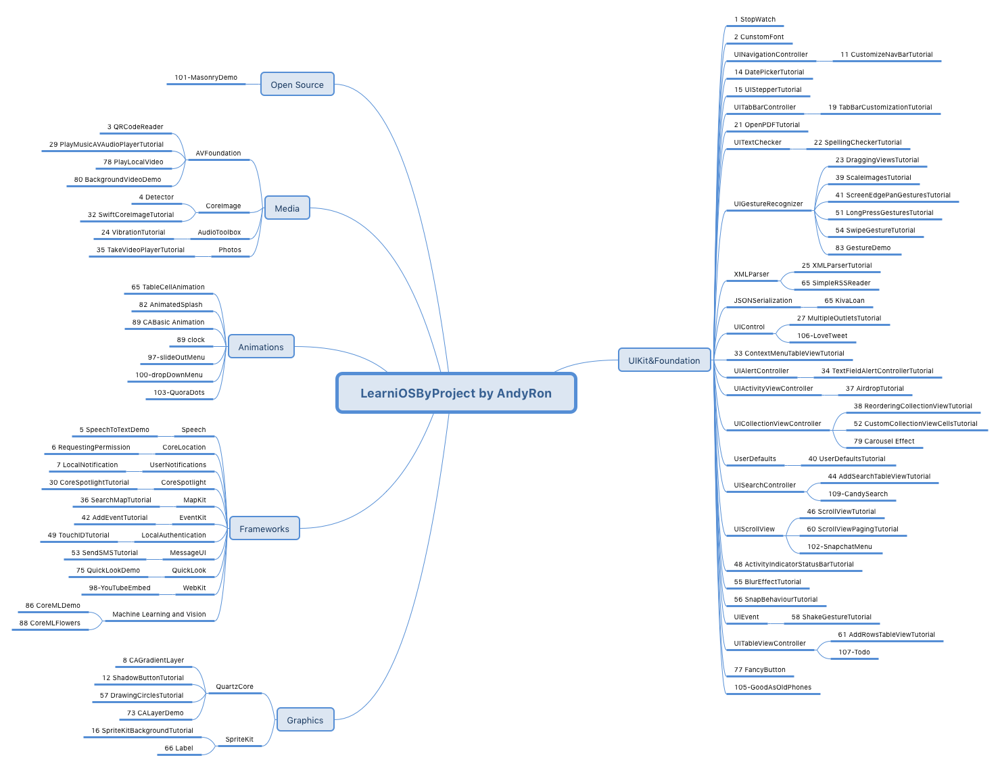
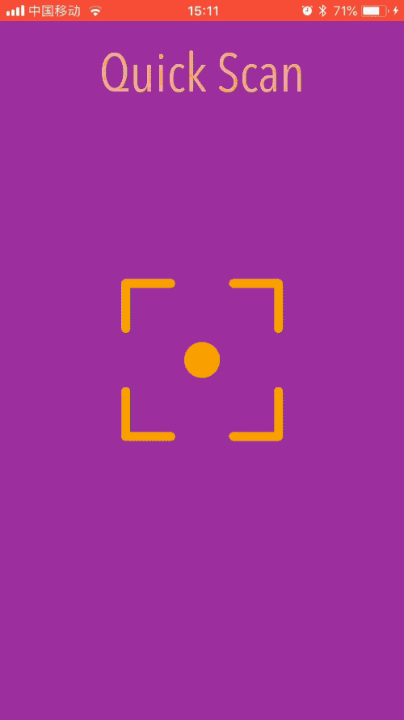
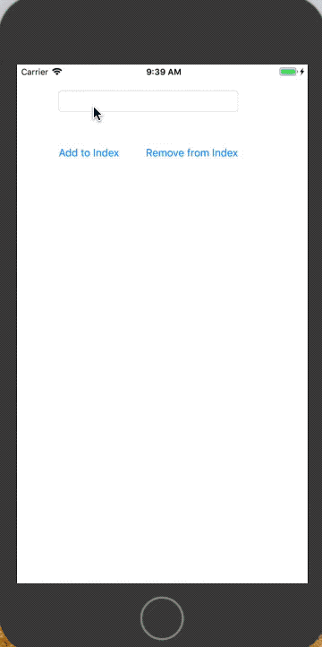
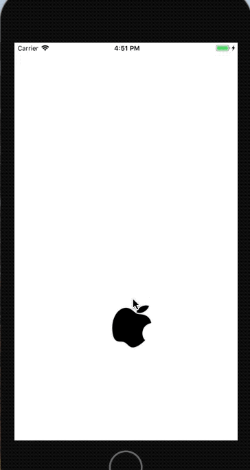
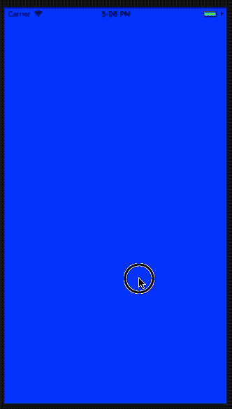
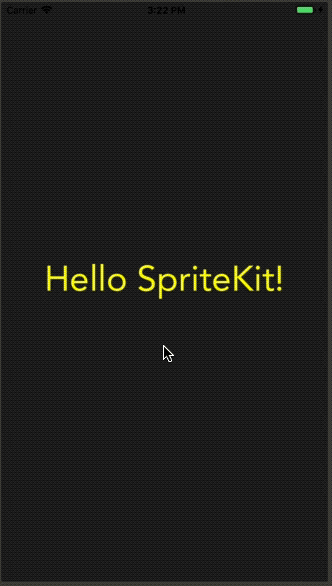
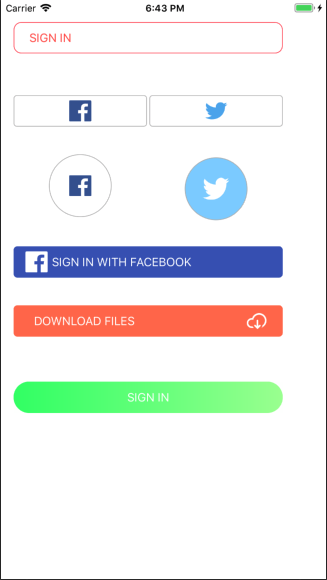
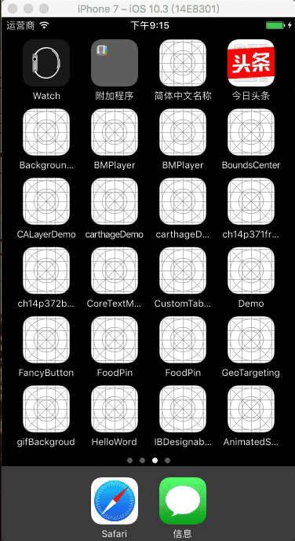
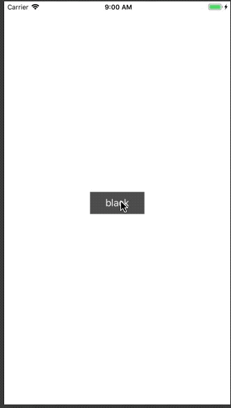
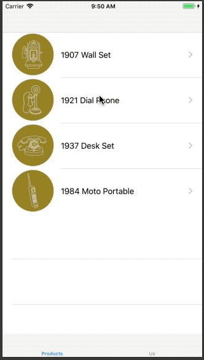

LearniOSByProject
-------

## 介绍

**[LearniOSByProject](https://github.com/andyRon/LearniOSByProject)**本来是自己学习iOS时的一些非常简单小例子，小项目，或者我个人博客[AndyRon's Blog](http://andyron.com)文章的代码集合。没有按照什么路线学习，就是学到什么就是什么了，看上去特别乱，我自己有时候也非常懵逼，然后看到道长前辈的项目[Swift-30-Projects](https://github.com/soapyigu/Swift-30-Projects)，就整理、筛选一下，这样看着清晰一点，找起来也方便。  

- 语言方面大部分是Swift，个别项目是OC。
- 以数字为目录只是为了记录项目数和排序，没有特殊意义。
- 下载单个项目可以参考 [DownGit：怎么下载github中某个文件夹？](http://andyron.com/2017/downgit)

## 总览图

## 学习一些来源
- http://www.appcoda.com/
- https://www.ioscreator.com/
- https://www.raywenderlich.com/
- **[30DaysofSwift](https://github.com/allenwong/30DaysofSwift)**
- **[Swift-30-Projects](https://github.com/soapyigu/Swift-30-Projects)**

## 详细列表

`??`表示有疑问的还没完成的项目。题目后面的如**UIKit&Foundation**，**AVFoundation**是分类名。

### 1 StopWatch             UIKit&Foundation
**StopWatch**是对`Timer`简单使用。

### 2 CunstomFont           UIKit&Foundation
加载字体文件修改字体

### 3 QRCodeReader          AVFoundation
用`AVFoundation`来识别二维码or条形码

### 4 Detector      CoreImage
用**CoreImage**进行面部识别

### 5 SpeechToTextDemo     Speech
语音转换为文字

### 6 RequestingPermission  CoreLocation
用户当前位置

### 7 LocalNotification     UserNotifications
本地通知

### 8 CAGradientLayer       QuartzCore
颜色渐变

### 9 OneHourWalker ??
 http://www.appcoda.com/healthkit-introduction/

### 10 TwitterTutorial   ??
分享到推特

### 11 CustomizeNavBarTutorial      UIKit&Foundation
定制导航栏

### 12 ShadowButtonTutorial         QuartzCore
button的阴影

### 13 FadeMusicTutorial   ??
音乐的声音的渐变

### 14 DatePickerTutorial       UIKit&Foundation
日期选择器使用

### 15 UIStepperTutorial        UIKit&Foundation
`UIStepper`的使用

### 16 SpriteKitBackgroundTutorial      SpriteKit
`SpriteKit`背景设置

### 17 DrawShapesTutorial  

### 18 DrawGradientsTutorial 

### 19 TabBarCustomizationTutorial      UIKit&Foundation
定制TabBar

### 20 ChangeDisplayNameTutorial  
改变app在Home screen时的显示名。修改**info.plist**中**Bundle display name**。

### 21 OpenPDFTutorial      UIKit&Foundation
通过`UIWebView`打开PDF文件

### 22 SpellingCheckerTutorial      UIKit&Foundation 
检查英语单词拼写是否正确(UITextChecker)

### 23 DraggingViewsTutorial        UIKit&Foundation
视图拖动

### 24 VibrationTutorial        AudioToolbox
震动 

### 25 XMLParserTutorial       UIKit&Foundation
XML文件解析。知识点：`XMLParser`

### 26 DrawRouteMapKitTutorial ??
在地图上划线。知识点[参考](https://www.ioscreator.com/tutorials/draw-route-mapkit-tutorial)

### 27 MultipleOutletsTutorial      UIKit&Foundation
`UIView`的`tag`使用和事件添加

### 28 SpriteKitPhysicsTutorial  ??

- [参考](https://www.ioscreator.com/tutorials/sprite-kit-physics-tutorial)

### 29 PlayMusicAVAudioPlayerTutorial       AVFoundation
音频的播放、暂停和停止。知识点：`AVFoundation`

### 30 CoreSpotlightTutorial            CoreSpotlight 
应用内搜索框架`Core Spotlight`简单使用

### 31 SwiftFileManagementTutorial  ?? 
try? ?
- [参考](https://www.ioscreator.com/tutorials/file-management-tutorial-ios8-swift)

### 32 SwiftCoreImageTutorial       CoreImage
`CoreImage`的图片滤镜功能

### 33 ContextMenuTableViewTutorial         UIKit&Foundation   
table的cut/copy/paste操作

### 34 TextFieldAlertControllerTutorial     UIKit&Foundation
UIAlertController的简单使用

### 35 TakeVideoPlayerTutorial          Photos
拍摄视频和查看图库

### 36 SearchMapTutorial            MapKit
搜索地图。知识点：`MapKit` `MKLocalSearchRequest`  `MKCoordinateSpan` `MKLocalSearch`

### 37 AirdropTutorial         UIKit&Foundation 
分享功能。 知识点：`UIActivityViewController`，`UIActivityType`
 
### 38 ReorderingCollectionViewTutorial     UIKit&Foundation 
`UICollectionViewController`的基本使用

### 39 ScaleImagesTutorial          UIKit&Foundation
`UIPinchGestureRecognizer`的使用。知识点`UIPinchGestureRecognizer` ， `CGAffineTransform`。

### 40 UserDefaultsTutorial     UIKit&Foundation  
UserDefaults的基本使用。程序被杀掉后数据还能保存。

### 41 ScreenEdgePanGesturesTutorial        UIKit&Foundation
屏幕边缘手势`UIScreenEdgePanGestureRecognizer`的使用

### 42 AddEventTutorial     EventKit
向日历中添加提醒。知识点：`EventKit` ， `EKEventStore`。

### 43 ToadyExtension  ??
- 知识点
    + `ProcessInfo().operatingSystemVersion`
    + **Application Extension**

### 44 AddSearchTableViewTutorial       UIKit&Foundation
为TableView添加搜索栏。知识点：`UISearchController`, `NSPredicate`

### 45 MoveViewKeyboardTutorial  ??
(https://www.ioscreator.com/tutorials/move-view-behind-keyboard-ios8-swift)

### 46 ScrollViewTutorial 
`UIScrollView`的简单使用

### 47 EmailTutorial  ??

### 48 ActivityIndicatorStatusBarTutorial       UIKit&Foundation
状态栏中的菊花转

### 49 TouchIDTutorial          LocalAuthentication
TouchID的简单使用

### 50 CustomFontTutorial
类似2

### 51 LongPressGesturesTutorial        UIKit&Foundation
长按手势
    
### 52 CustomCollectionViewCellsTutorial        UIKit&Foundation
UICollectionViewController的简单使用

### 53 SendSMSTutorial          MessageUI
调用**信息**APP发送短信。知识点：`MessageUI` `MFMessageComposeViewControllerDelegate` `MFMessageComposeViewController`。

### 54 SwipeGestureTutorial         UIKit&Foundation
`UISwipeGestureRecognizer`（某个方向上的滑动）手势使用

### 55 BlurEffectTutorial           UIKit&Foundation
模糊效果。知识点：`UIBlurEffect`，`UIVisualEffectView`。

### 56 SnapBehaviourTutorial        UIKit&Foundation
`UISnapBehavior`效果。

### 57 DrawingCirclesTutorial       QuartzCore
画圆

### 58 ShakeGestureTutorial         UIKit&Foundation
检测震动事件。知识点：`UIEventSubtype`, `UIEvent`.

### 59 VolumeTutorial  ??

### 60 ScrollViewPagingTutorial     UIKit&Foundation
用`UIScrollView`做左右翻页效果。

### 61 AddRowsTableViewTutorial     UIKit&Foundation 
TableView添加行。

### 62 PathsNLayers  ??
- [参考](http://www.appcoda.com/bezier-paths-introduction/)
- https://developer.apple.com/library/content/documentation/2DDrawing/Conceptual/DrawingPrintingiOS/BezierPaths/BezierPaths.html
- 知识点
    + `UIBezierPath`  create vector-based paths
    + `CGContext`   `CAShapeLayer`
- goal in this tutorial is to give you practical guidelines on how to create bezier paths and how to use shape layer objects along with them

### 63 Delicious  ??
Building a Custom Content View with UITableView and MapKit
- https://www.appcoda.com/custom-content-view/
- 以 Cureo(http://curetoapp.com/) 应用的为例来展示

### 64 Firebase  ??
            

### 65 
《Intermediate iOS 10 Programming with Swift》
- appcoda 网站书籍[Intermediate iOS 10 Programming with Swift](https://www.appcoda.com/intermediate-swift-programming-book/)的学习笔记。**Intermediate**每一节是一个项目

### 66 Label        SpriteKit
SpriteKit学习

### 67 UILabelDemo

### 68 Exif ??
 
### 69 UIButtonDemo

### 70 

### 71 A Beginning’s Guide to Lottie: Creating Amazing Animations in iOS Apps 

### 72  ??

### 73 CALayerDemo      QuartzCore
CALayer学习

### 74 GeoTargeting  !!

### 75 QuickLookDemo        QuickLook
`QuickLook`的使用

### 76 localizationsDemo
本地化

### 77 FancyButton          UIKit&Foundation
IBDesignable和IBInspectable的使用

### 78 PlayLocalVideo       AVFoundation
本地视频播放

### 79 Carousel Effect      UIKit&Foundation
用`UICollectionView`实现照片横屏滑动

### 80 BackgroundVideoDemo          AVFoundation
视频背景

### 81 gifBackgroud  
使用gif作为背景。但大小不好控制！！

### 82 AnimatedSplash           Animations
Twitter开启动画

### 83 GestureDemo          UIKit&Foundation
手势处理集合

### 84 ?? 

### 85

### 86 CoreMLDemo           Machine Learning and Vision
CoreML的简单使用

### 87 StreetView ??
http://www.appcoda.com/google-street-view-ios/

### 88 CoreMLFlowers        Machine Learning and Vision
与86类似，只是model用的是识别花的`Flowers.mlmodel`

### 89-Animation            Animations
CABasic Animation
clock
基础动画 

### 90-iOSJS    iOS和JS
- **OCJS1**     使用URL拦截的方式进行JS与OC互相调用
- OCJSMessageHandler  SwiftJSMessageHandler   

### 91-network   iOS网络编程
NSURLSession(delegate)
NSURLSession(block)

### 92 
https://yq.aliyun.com/articles/39473?spm=5176.8091938.0.0.YHIb2U

### 93-sandbox

### 94-MutipleThread
https://www.kancloud.cn/digest/data/106700

### 95-Socket
参考：[深入浅出－iOS的TCP/IP协议族剖析&&Socket](http://www.jianshu.com/p/cc756016243b)

### 96-gif
用`UIWebView`加载gif图片。

### 97-slideOutMenu         Animations
简单的滑动菜单(NSLayoutConstraint)

### 98-YouTubeEmbed         WebKit
`WKWebView`播放在线视频

### 99-CustomTableViewCell  UIKit&Foundation
定制CustomTableViewCell 

### 100-dropDownMenu        Animations
简单的下拉菜单

### 101-MasonryDemo         Open Source
Masonry实现一个计算器界面

### 102-SnapchatMenu        UIKit&Foundation
通过`UIScrollView`实现Snap聊天页面左右滑动  

### 103-QuoraDots       Animations
Quora启动的加载动画

### 104-Tumblr  ??
Tumblr添加操作时的动画

### 105-GoodAsOldPhones        UIKit&Foundation 
tab bar controller, navigation controller, scoll view, table view and storyboard的使用

### 106-LoveTweet           UIKit&Foundation
UILabel, UITextField, UISegmentedControl, UIDatePicker, UISlider, UISwitch, UIButton and UITextView等**UIKit controls**的使用

### 107-Todo            UIKit&Foundation
tableview add, edit and delete

### 108-Artistry  ??
set up height for table view cells dynamica
lly based on its content

### 109-CandySearch     UIKit&Foundation
UISearchController和UISplitViewController的使用
https://www.raywenderlich.com/157864/uisearchcontroller-tutorial-getting-started

### 110-FacebookMe  ??
模仿fb的个人页面

### 111-PhotoScroll  ??

### 112-ClassicPhotos
Operation 和 OperationQueue 使用

### 113-FlickrSearch
UICollectionViewController学习

### 114-SnapKitDemo             Open Source
SnapKit实现一个计算器界面

### 115-PersistData
数据持久化的几个例子

### 116-ReusableKnob

## 一些项目的预览图

